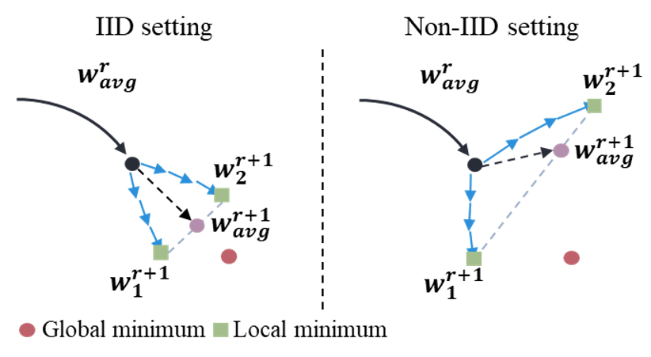

# Federated Learning with Non-IID Data

This is an implementation of the following paper:
> Yue Zhao, Meng Li, Liangzhen Lai, Naveen Suda, Damon Civin, Vikas Chandra.
**Federated Learning with Non-IID Data**  
_arXiv:1806.00582_.

[Paper](https://arxiv.org/abs/1806.00582)

**TL;DR**: Previous federated optization algorithms (such as FedAvg and FedProx) converge to stationary points of a mismatched objective function due to heterogeneity in data distribution. In this paper, the authors propose a data-sharing strategy to improve training on non-IID data by creating a small subset of data which is globally shared between all the edge devices.

<p align="center">  
    ​
</p>

**Abstract**: Federated learning enables resource-constrained edge compute devices, such as mobile phones and IoT devices, to learn a shared model for prediction, while keeping the training data local.  This decentralized approach to train models provides privacy, security, regulatory and economic benefits. In this work, we focus on the statistical challenge of federated learning when local data is non-IID. We first show that the accuracy of federated learning reduces significantly, by up to ~55% for neural networks trained for highly skewed non-IID data, where each client device trains only on a single class of data. We further show that this accuracy reduction can be explained by the weight divergence, which can be quantified by the earth mover’s distance (EMD) between the distribution over classes on each device and the population distribution. As a solution, we propose a strategy to improve training on non-IID data by creating a small subset of data which is globally shared between all the edge devices. Experiments show that accuracy can be increased by ~30% for the CIFAR-10 dataset with only 5% globally shared data.

## Requirements
The implementation runs on:
- Python 3.8
- PyTorch 1.6.0
- CUDA 10.1
- cuDNN 7.6.5

## Federated Learning Algorithms
Currently, this repository supports the following federated learning algorithms:
- FedAvg ([Mcmahan et al. AISTAT 2017](https://arxiv.org/abs/1602.05629)): local solver is vanilla SGD; aggregate cumulative local model changes
- FedProx ([Li et al. MLSys 2020](https://arxiv.org/abs/1812.06127)): local solver is proximal SGD; aggregate cumulative local model changes

## Launch Experiments
An example launch script is shown below.
```bash
python main.py 
    --all_clients \
    --fed fedavg \
    --gpu 0 \
    --seed 1 \
    --sampling noniid \
    --sys_homo \
    --num_channels 3 \
    --dataset cifar
```
Explanations of arguments:
- `fed`: federated optimization algorithm
- `mu`: parameter for fedprox
- `sampling`: sampling method
- `alpha`: random portion of global dataset
- `dataset`: name of dataset
- `rounds`: total number of communication rounds
- `sys_homo`: no system heterogeneity

## Acknowledgements
Referred http://doi.org/10.5281/zenodo.4321561
